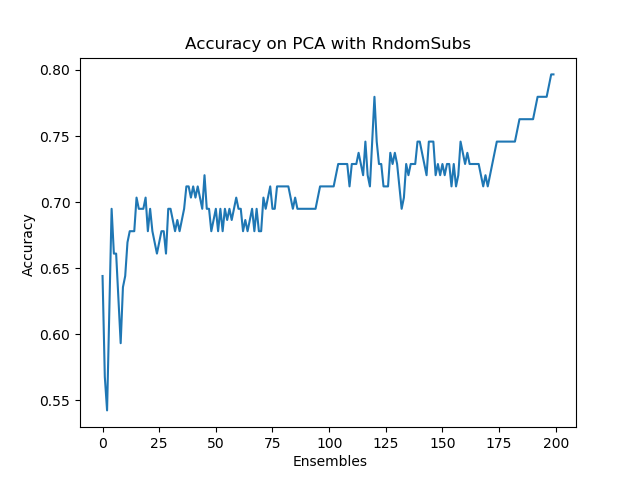

## Summary of the project

This file contains the summary of the main project I have been developing at my current work place.
It covers the task of classifying patients with Alzheimer from control patients.

The code is provided as a demo for the hiring processes and contains lots of bad syntax
habits that would be cleaned up in final versions of the project.

## Description of the data

This is what one sample of the data looks like. It is a matrix of PLV (phase lock value) in between
90 ROI's in the brain (parcellations that serve mainly the same task, so that it is easier to work with
brain measurements).

## Classification strategies

So far I've tried several strategies on this dataset being the most prevalent the approach of bagging the dataset,
implementing the kernel trick and applying a Logistic Regressor. This strategy yields an accuracy of 80% on
Leave One Out Cross Validation.

The last technique that I have been programming is replacing the Logistic Regressor with a Mixture of Experts.
